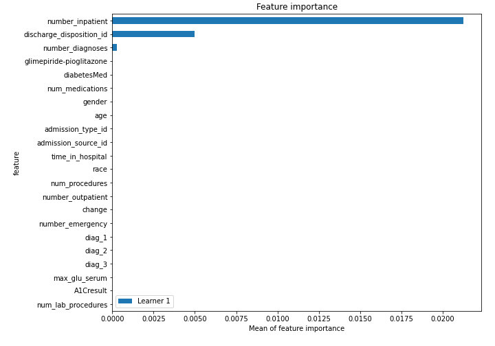

# Summary of 2_DecisionTree

[<< Go back](../README.md)

## Decision Tree
- **n_jobs**: -1
- **criterion**: gini
- **max_depth**: 3
- **explain_level**: 2

## Validation
 - **validation_type**: split
 - **train_ratio**: 0.75
 - **shuffle**: True
 - **stratify**: True

## Optimized metric
logloss

## Training time

65.7 seconds

## Metric details
|           |    score |   threshold |
|:----------|---------:|------------:|
| logloss   | 0.337409 |  nan        |
| auc       | 0.617355 |  nan        |
| f1        | 0.262027 |    0.128977 |
| accuracy  | 0.88016  |    0.256289 |
| precision | 0.361393 |    0.256289 |
| recall    | 1        |    0.07194  |
| mcc       | 0.153065 |    0.128977 |

## Metric details with threshold from accuracy metric
|           |     score |   threshold |
|:----------|----------:|------------:|
| logloss   | 0.337409  |  nan        |
| auc       | 0.617355  |  nan        |
| f1        | 0.146428  |    0.256289 |
| accuracy  | 0.88016   |    0.256289 |
| precision | 0.361393  |    0.256289 |
| recall    | 0.0918142 |    0.256289 |
| mcc       | 0.135356  |    0.256289 |

## Confusion matrix (at threshold=0.256289)
|              |   Predicted as 0 |   Predicted as 1 |
|:-------------|-----------------:|-----------------:|
| Labeled as 0 |            21072 |              440 |
| Labeled as 1 |             2463 |              249 |

## Learning curves

## Permutation-based Importance

## Confusion Matrix

## Normalized Confusion Matrix

## ROC Curve

## Kolmogorov-Smirnov Statistic

## Precision-Recall Curve

## Calibration Curve

## Cumulative Gains Curve

## Lift Curve

## SHAP Importance

## SHAP Dependence plots

### Dependence (Fold 1)

## SHAP Decision plots

### Top-10 Worst decisions for class 0 (Fold 1)

### Top-10 Best decisions for class 0 (Fold 1)

### Top-10 Worst decisions for class 1 (Fold 1)

### Top-10 Best decisions for class 1 (Fold 1)

[<< Go back](../README.md)
