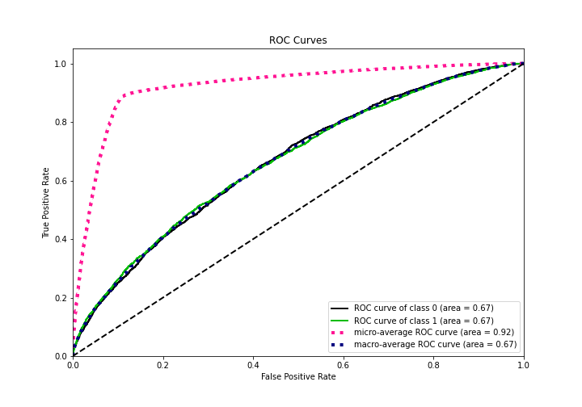

# Summary of Ensemble

[<< Go back](../README.md)

## Ensemble structure
| Model             |   Weight |
|:------------------|---------:|
| 3_Default_Xgboost |        3 |

## Metric details
|           |    score |    threshold |
|:----------|---------:|-------------:|
| logloss   | 0.331272 | nan          |
| auc       | 0.666143 | nan          |
| f1        | 0.2763   |   0.135502   |
| accuracy  | 0.879087 |   0.257128   |
| precision | 0.36036  |   0.257128   |
| recall    | 1        |   0.00887562 |
| mcc       | 0.162347 |   0.162929   |

## Metric details with threshold from accuracy metric
|           |    score |   threshold |
|:----------|---------:|------------:|
| logloss   | 0.331272 |  nan        |
| auc       | 0.666143 |  nan        |
| f1        | 0.160504 |    0.257128 |
| accuracy  | 0.879087 |    0.257128 |
| precision | 0.36036  |    0.257128 |
| recall    | 0.103245 |    0.257128 |
| mcc       | 0.143413 |    0.257128 |

## Confusion matrix (at threshold=0.257128)
|              |   Predicted as 0 |   Predicted as 1 |
|:-------------|-----------------:|-----------------:|
| Labeled as 0 |            21015 |              497 |
| Labeled as 1 |             2432 |              280 |

## Learning curves

## Confusion Matrix

## Normalized Confusion Matrix

## ROC Curve

## Kolmogorov-Smirnov Statistic

## Precision-Recall Curve

## Calibration Curve

## Cumulative Gains Curve

## Lift Curve

[<< Go back](../README.md)
